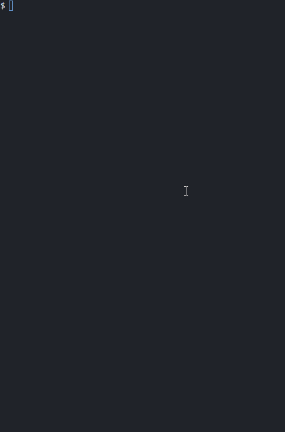

# Blackjack
## Introduction
This is a typical 1 on 1 Blackjack game played by the terminal. It is built with C++ Object Oriented Programming (OOP).

## Language
C++

## Getting Started
- Install libstdc++6
- Complie code / Run a.exe
```bash
g++ main.cpp cards.cpp game.cpp util.cpp actions.cpp
./a.exe
```

## Functions
- Draw
- Stand
- Double down
- Split

## Preview
||
|----------------------------------------|
||
||
||

## Epilogue
This project is built to refresh my memories in C++ OOP, it is a simple project yet fun to make. Enjoy!
